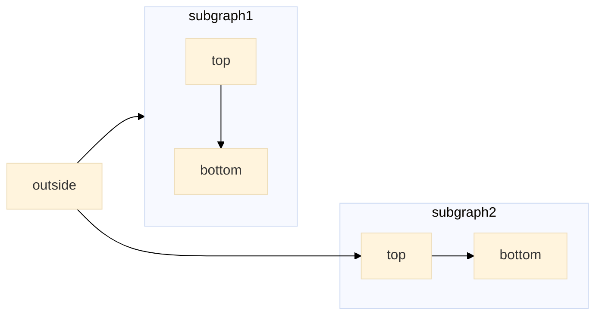
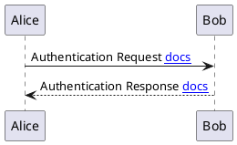
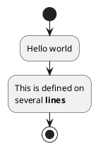

# Examples

## Mermaid Diagrams



<!-- tabs:start -->

### **UML Use Case Diagram**

Hello!

### **UML Sequence Diagram**

Bonjour!

### **UML Component Diagram**

Ciao!

<!-- tabs:end -->

## PlantUML Diagrams





## Code Blocks

```javascript
// This is a comment
var x = 1;
```
